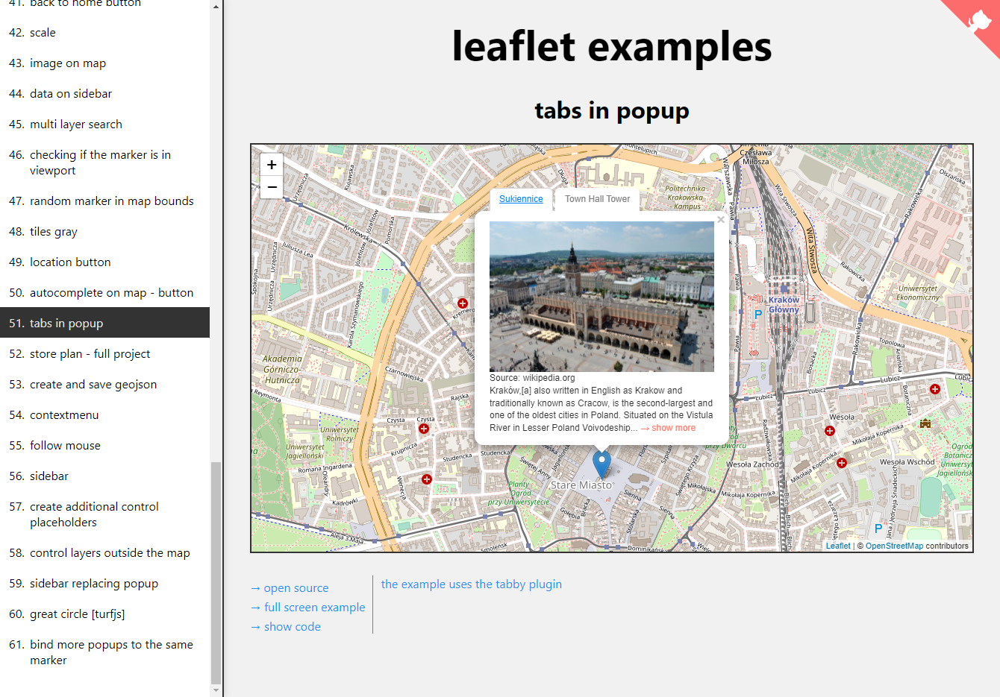

# :maple_leaf: leaflet-examples

**leaflet-examples** a collection of examples of leaflet map usage

> The react version can be found at this link [react-leaflet-examples](https://github.com/tomik23/react-leaflet-examples).

## Demo

Here is a working live demo : https://tomik23.github.io/leaflet-examples/

> Work in progress :smiley: Suggestions welcome :bulb:.

55 [follow-mouse](https://tomik23.github.io/leaflet-examples/#55.follow-mouse)  
54 [contextmenu](https://tomik23.github.io/leaflet-examples/#54.contextmenu)  
53 [create-and-save-geojson](https://tomik23.github.io/leaflet-examples/#53.create-and-save-geojson)  
52 [full-project](https://tomik23.github.io/leaflet-examples/#52.full-project)  
51 [tabs-in-popup](https://tomik23.github.io/leaflet-examples/#51.tabs-in-popup)  
50 [autocomplete-on-map](https://tomik23.github.io/leaflet-examples/#50.autocomplete-on-map)  
49 [location-button](https://tomik23.github.io/leaflet-examples/#49.location-button)  
48 [tiles-gray](https://tomik23.github.io/leaflet-examples/#48.tiles-gray)  
47 [random-marker-in-map-bounds](https://tomik23.github.io/leaflet-examples/#47.random-marker-in-map-bounds)  
46 [checking-if-the-marker-is-in-viewport](https://tomik23.github.io/leaflet-examples/#46.checking-if-the-marker-is-in-viewport)  
45 [multi-layer-search](https://tomik23.github.io/leaflet-examples/#45.multi-layer-search)  
44 [sidebar](https://tomik23.github.io/leaflet-examples/#44.sidebar)  
43 [image-on-map](https://tomik23.github.io/leaflet-examples/#43.image-on-map)  
42 [scale](https://tomik23.github.io/leaflet-examples/#42.scale)  
41 [back-to-home-button](https://tomik23.github.io/leaflet-examples/#41.back-to-home-button)  
40 [distance-between-cities-on-map](https://tomik23.github.io/leaflet-examples/#40.distance-between-cities-on-map)  
39 [coordinates-of-the-center-of-the-visible-map](https://tomik23.github.io/leaflet-examples/#39.coordinates-of-the-center-of-the-visible-map)  
38 [part-of-the-common](https://tomik23.github.io/leaflet-examples/#38.part-of-the-common)  
37 [enlarge-a-polygon-box-by-5%](https://tomik23.github.io/leaflet-examples/#37.enlarge-a-polygon-box-by-5-percent)  
36 [story-maps-IntersectionObserver](https://tomik23.github.io/leaflet-examples/#36.story-maps-IntersectionObserver)  
35 [marker-draggable-on-a-click](https://tomik23.github.io/leaflet-examples/#35.marker-draggable-on-a-click)  
34 [multiple-tile-layers](https://tomik23.github.io/leaflet-examples/#34.multiple-tile-layers)  
33 [location](https://tomik23.github.io/leaflet-examples/#33.location)  
32 [image-icons-prev-next](https://tomik23.github.io/leaflet-examples/#32.image-icons-prev-next)  
31 [awesome-markers](https://tomik23.github.io/leaflet-examples/#31.Leaflet.awesome-markers)  
30 [mini-map](https://tomik23.github.io/leaflet-examples/#30.mini-map)  
29 [linked-view](https://tomik23.github.io/leaflet-examples/#29.linked-view)  
28 [adding-map-description](https://tomik23.github.io/leaflet-examples/#28.adding-map-description)  
27 [fullscreen](https://tomik23.github.io/leaflet-examples/#27.fullscreen)  
26 [markers-60K](https://tomik23.github.io/leaflet-examples/#26.markers-60K)  
25 [fitBounds-with-padding](https://tomik23.github.io/leaflet-examples/#25.fitBounds-with-padding)  
24 [polyline](https://tomik23.github.io/leaflet-examples/#24.polyline)  
23 [custom-marker-and-popup](https://tomik23.github.io/leaflet-examples/#23.custom-marker-and-popup)  
22 [center-map-when-click-marker](https://tomik23.github.io/leaflet-examples/#22.center-map-when-click-marker)  
21 [geocoding-addresses-search-engine-outside-the-map](https://tomik23.github.io/leaflet-examples/#21.geocoding-addresses-search-engine-outside-the-map)  
20 [maxBound-map-restricts-the-view](https://tomik23.github.io/leaflet-examples/#20.maxBound-map-restricts-the-view)  
19 [custom-button](https://tomik23.github.io/leaflet-examples/#19.custom-button)  
18 [add-move-and-delete-marker](https://tomik23.github.io/leaflet-examples/#18.add-move-and-delete-marker)  
17 [TileLayer](https://tomik23.github.io/leaflet-examples/#17.tileLayer)  
16 [geoJson-extended-action](https://tomik23.github.io/leaflet-examples/#16.geoJson-extended-action)  
15 [geoJson-simple](https://tomik23.github.io/leaflet-examples/#15.geoJson-simple)  
14 [dragable-markers](https://tomik23.github.io/leaflet-examples/#14.dragable-markers)  
13 [svg-markers-width-legends](https://tomik23.github.io/leaflet-examples/#13.svg-markers-width-legends)  
12 [controling-polygons](https://tomik23.github.io/leaflet-examples/#12.controling-polygons)  
11 [controlling-the-map-from-outside-the-map](https://tomik23.github.io/leaflet-examples/#11.controlling-the-map-from-outside-the-map)  
10 [matching-all-markers-to-the-map-view](https://tomik23.github.io/leaflet-examples/#10.matching-all-markers-to-the-map-view)  
09 [marker-grouping-markercluster-plugin](https://tomik23.github.io/leaflet-examples/#09.marker-grouping-markercluster-plugin)  
08 [controlling-different-groups-of-markers](https://tomik23.github.io/leaflet-examples/#08.controlling-different-groups-of-markers)  
07 [image-instead-of-map](https://tomik23.github.io/leaflet-examples/#07.image-instead-of-map)  
06 [coordinates-of-the-visible-map](https://tomik23.github.io/leaflet-examples/#06.coordinates-of-the-visible-map)  
05 [coordinates-after-clicking-on-the-map](https://tomik23.github.io/leaflet-examples/#05.coordinates-after-clicking-on-the-map)  
04 [many-markers](https://tomik23.github.io/leaflet-examples/#04.many-markers)  
03 [adding-one-marker](https://tomik23.github.io/leaflet-examples/#03.adding-one-marker)  
02 [changing-locate-zoom-control](https://tomik23.github.io/leaflet-examples/#02.changing-locate-zoom-control)  
01 [simple-map](https://tomik23.github.io/leaflet-examples/#01.simple-map)
